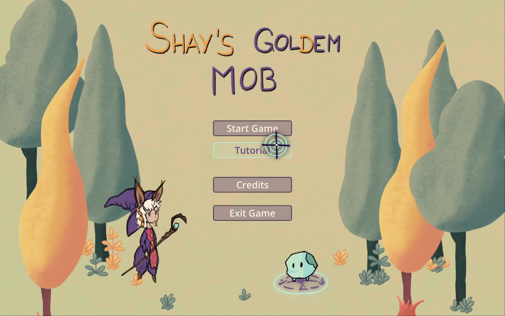
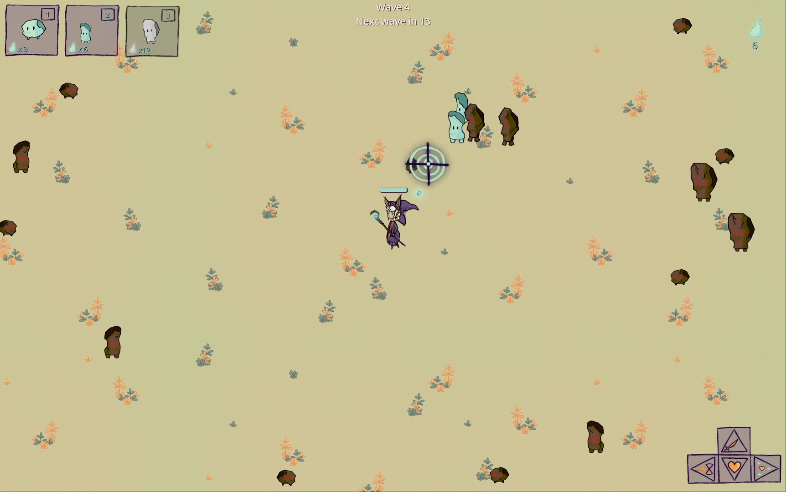

# Ludum-Dare-55
A Godot game which was developed in the [55th Ludum Dare](https://ldjam.com/events/ludum-dare/55) (13.04.2024 - 16.04.2024)

**Theme:** Summoning

Explore Shay's magical world as she, a whimsical fox fairy, battles monsters to cleanse the fairy meadow. With her summoned golem helpers, she must survive waves of enemies. Collect 'souls' to summon golems with unique skills.

**Instructions:**
+ W, A, S, D to move around
+ Move the mouse to aim
+ Left mouse button to shoot
+ 1, 2, or 3 to start summoning a golem
+ Arrow keys to customize your summoned golem with exactly 5 inputs.
+ During gameplay, press M to return to the menu

### [Vie on itch.io](https://kyunru.itch.io/shays-goldem-mob)

 